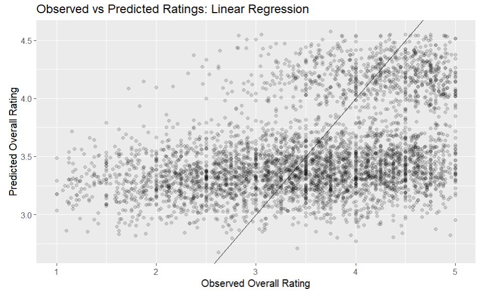

# Summary

The goal of this project was to investigate whether professor ratings on RateMyProfessor are associated with perception-related variables such as scientific age, discipline, race, gender, hotness status, and mentions of accent in reviews. I explored whether these variables could help explain differences in student evaluations.

The exploratory analysis showed that discipline, hotness status, and mentions of accent appeared more strongly associated with ratings than scientific age. Professors in Humanities and Social Sciences generally received higher ratings, while professors with accent mentions tended to receive somewhat lower ratings on average.

I fit both a regression tree model and a multiple linear regression model to predict professor ratings using these variables. Both models performed similarly, with RMSE values around 0.85, suggesting moderate predictive accuracy.

Figure 1 shows the observed versus predicted ratings from the linear regression model. Points closer to the diagonal line represent more accurate predictions. The graph shows that the model captures general trends in the data, but many predictions remain spread away from the line, suggesting that additional factors beyond the variables included in this project likely influence professor ratings.



# Motivation and Context

```{r}
#| label: do this first
#| echo: false
#| message: false

here::i_am("finalprojectmath437.qmd")
```

Student evaluations are commonly used to measure teaching effectiveness in colleges and universities, but ratings may also be influenced by perception-related factors beyond teaching quality. Variables such as gender, race, age, attractiveness, and accent may affect how students evaluate professors.

In this project, I investigated whether professor ratings on RateMyProfessor are associated with variables such as scientific age, discipline, race, gender, hotness status, and mentions of accent in reviews. I used exploratory data analysis along with supervised learning models, including a regression tree and multiple linear regression, to better understand which factors appear most associated with professor ratings and how well these variables predict student evaluations

# Packages Used In This Analysis

```{r}
#| label: load packages
#| message: false
#| warning: false

library(rsample)
library(tune)
library(dials)
library(recipes)
library(ggplot2)
library(dplyr)
library(broom)
library(readr)
library(here)
library(parsnip)
library(workflows)
library(yardstick)
library(tidyr)
```

| Package | Use |
|--------------------------------|----------------------------------------|
| [here](https://github.com/jennybc/here_here) | to easily load and save data |
| [readr](https://readr.tidyverse.org/) | to import the CSV file data |
| [dplyr](https://dplyr.tidyverse.org/) | to massage and summarize data |
| [rsample](https://rsample.tidymodels.org/) | to split data into training and test sets |
| [ggplot2](https://ggplot2.tidyverse.org/) | to create nice-looking and informative graphs |
| [tune](https://tune.tidymodels.org/) | tuning the regression tree |
| [dials](https://dials.tidymodels.org/) | tuning parameter grids |
| [recipes](https://recipes.tidymodels.org/) | to preprocess and transform variables before modeling |
| [broom](https://broom.tidymodels.org/) | to tidy and augment model outputs |
| [workflows](https://workflows.tidymodels.org/) | to combine preprocessing and models into one pipeline |
| [parsnip](https://parsnip.tidymodels.org/) | to define machine learning models using a consistent interface |
| [yardstick](https://yardstick.tidymodels.org/) | to evaluate model performance using RMSE and other metrics |
| [tidyr](https://tidyr.tidyverse.org/) | help create tidy data |

# Data Description

This data was originally collected by Murray et al. and their team to try to understand the relationship between a professor's research output and teaching effectiveness. To quantify effectiveness, they collected information about U.S. tenure-track faculty who appear in both RateMyProfessor.com and Academic Analytics. Each observation (row) represents one faculty member and we have 22038 observations in total. The data Murray et al. collected also has 32 variables.

```{r}
#| label: import data
#| warning: false

rmp <- readr::read_csv(here::here("aarmp_final.csv"))


```

# Data Wrangling

```{r}
#| label: clean-data-and-train-test-split

rmp_bias <- rmp |>
  select(
    overall,
    mentions_accent,
    scientific_age,
    race,
    discipline,
    hotness,
    gender,
  ) |>
  mutate(
    gender = as.factor(gender),
    discipline = as.factor(discipline),
    hotness = as.factor(hotness),
    mentions_accent = as.factor(mentions_accent),
  ) |>
  drop_na()

set.seed(437)

rmp_bias_split <- initial_split(rmp_bias, prop = 0.80, strata = overall)

rmp_bias_train <- training(rmp_bias_split)
rmp_bias_test <- testing(rmp_bias_split)


```

I did some limited data wrangling, but the data set was already mostly clean and ready for analysis. I selected variables that were most relevant to my project question, which focuses on whether professor ratings are associated with perception-related variables such as scientific age, discipline, gender, race, hotness, and mentions of accent in reviews.I also used an 80% training and 20% testing split. This gives the model a large amount of data to learn patterns while saving enough observations to fairly evaluate model performance on unseen data.

# Exploratory Data Analysis

## univariate summaries and graphs

The variable overall is the average professor rating on RateMyProfessor, measured from 1 to 5. Since this is the main response variable in my project, I first produced a summary, and examined its distribution. This helps show whether professors are generally rated positively.

```{r}

rmp_bias_train |>
  summarize(
    mean_overall_train = mean(overall, na.rm = TRUE),
    sd_overall_train = sd(overall, na.rm = TRUE),
    min_train = min(overall, na.rm = TRUE),
    Q1_train = quantile(overall, 0.25, na.rm = TRUE),
    median_train = median(overall, na.rm = TRUE),
    Q3_train = quantile(overall, 0.75, na.rm = TRUE),
    max_train = max(overall, na.rm = TRUE)
  )

```

```{r}
ggplot(rmp_bias_train, aes(x = overall)) +
  geom_histogram(binwidth = 0.25, center = 0) +
  labs(
    title = "Distribution of Overall Professor Ratings",
    x = "Overall Rating",
    y = "Professor Count"
  )
```

The histogram shows how professor ratings are distributed across the data set. Most professors appear to receive ratings in the middle-to-higher range, suggesting that extremely low ratings are less common and that students hesitate to give out low ratings.

Another variable I wanted to explore was scientific_age, which measures the number of years since a professor received their highest degree. Student ratings may differ depending on professors experience. For example, professors with more experience may be more comfortable teaching their subject, while newer professors may relate differently to students. Professors with higher scientific age may also be older, which can affect teaching style and how students see them.

```{r}
rmp_bias_train |>
  summarize(
    mean_scientific_age_train = mean(scientific_age, na.rm = TRUE),
    sd_scientific_age_train = sd(scientific_age, na.rm = TRUE),
    min_scientific_age_train = min(scientific_age, na.rm = TRUE),
    Q1_scientific_age_train = quantile(scientific_age, 0.25, na.rm = TRUE),
    median_scientific_age_train = median(scientific_age, na.rm = TRUE),
    Q3_scientific_age_train = quantile(scientific_age, 0.75, na.rm = TRUE),
    max_scientific_age_train = max(scientific_age, na.rm = TRUE)
  )

```

```{r}
ggplot(rmp_bias_train, aes(x = scientific_age)) +
  geom_histogram(binwidth = 1, center = 0) +
  labs(
    title = "Distribution of scientific_age",
    x = "scientific_age",
    y = "Professor Count"
  )
```

The histogram shows that most professors have scientific ages between about 8 and 30 years, with the highest concentration around 10 to 20 years. There are fewer professors with very high scientific ages, creating a long right tail. This indicates that the distribution of scientific_age is right-skewed.

```{r}
#| label: discipline-bar-chart

ggplot(
  data = rmp_bias_train,
  mapping = aes(x = discipline)
) +
  geom_bar(fill = "darkorange") +
  labs(
    x = "Discipline",
    y = "Count",
    title = "Number of Professors by Discipline"
  )
```

I also examined the variable discipline, since student evaluations may differ across academic fields. This bar chart shows the number of professors represented in each discipline group. The way students feel about a subject could affect their rating. For example, lots of student form a bias against science due to not feeling comfortable with a subject, this could effect how they rate a professor.

## bivariate or multivariate trends (or lack thereof)

### Overall vs Scientific age

```{r}
ggplot(
  data = rmp_bias_train,
  mapping = aes(
    x = scientific_age,
    y = overall
  )
) +
  geom_point(
    alpha = 0.1 # transparency
  ) +
  #geom_smooth(
    #method = "lm",
    #se = FALSE # no confidence band
  #) +
  labs(
    title = "Overall Rating vs Scientific age",
    x = "scientific age",
    y = "Overall rating"
  )
```

I created a scatter plot of overall rating versus scientific_age to examine whether more experienced professors tend to receive different student ratings. The graph does not show a strong linear relationship between the two variables. Professors with both high and low ratings appear across nearly all levels of scientific age. This suggests that years since receiving a terminal degree may not be a strong predictor of professor ratings on its own.

there is lots of variation in ratings at every scientific age. This could suggest that other factors such as accent, race, discipline, hotness, and gender could play a role in ratings.

### How race impacts overall rating

```{r}
rmp_bias_train |>
  group_by(race) |>
  summarize(
    n = n(),
    mean_overall_by_race = mean(overall, na.rm = TRUE),
    sd_overall_by_race = sd(overall, na.rm = TRUE),
    min_by_race = min(overall, na.rm = TRUE),
    Q1_by_race = quantile(overall, 0.25, na.rm = TRUE),
    median_by_race = median(overall, na.rm = TRUE),
    Q3_by_race = quantile(overall, 0.75, na.rm = TRUE),
    max_by_race = max(overall, na.rm = TRUE)
  )
```

```{R}
ggplot(
  data = rmp_bias_train,
  mapping = aes(
    x = race,
    y = overall
  )
) + 
  geom_boxplot() +
  coord_flip() +
  geom_point(
    alpha = 0.1
  ) +
  labs(
    title = "Overall Rating by Race",
    x = "Race",
    y = "Overall Rating"
  )
```

I next explored whether professor ratings differed across race groups. The summary statistics and boxplots show that white faculty members had the highest average and median overall ratings, while non-white faculty members had the lowest. The unknown race group fell in between the other two groups. However, the boxplots show large overlap in the distributions, this indicates that many professors within each group received similar ratings. This suggests that race alone does not appear to have a strong association with overall rating.

### Additional follow up question 

Does discipline have visible impact on rating?

```{r}
rmp_bias_train |>
  group_by(discipline) |>
  summarize(
    n = n(),
    mean_overall_by_discipline = mean(overall, na.rm = TRUE),
    sd_overall_by_discipline = sd(overall, na.rm = TRUE),
    min_by_discipline = min(overall, na.rm = TRUE),
    Q1_by_discipline = quantile(overall, 0.25, na.rm = TRUE),
    median_by_discipline = median(overall, na.rm = TRUE),
    Q3_by_discipline = quantile(overall, 0.75, na.rm = TRUE),
    max_by_discipline = max(overall, na.rm = TRUE)
  )
```

```{R}
ggplot(
  data = rmp_bias_train,
  mapping = aes(
    x = discipline,
    y = overall
  )
) + 
  geom_boxplot() +
  coord_flip() +
  geom_point(
    alpha = 0.1
  ) +
  labs(
    title = "Overall Rating by discipline",
    x = "discipline",
    y = "Overall Rating"
  )
```

As a follow-up question, I explored whether professor ratings differed across academic disciplines. Student expectations and teaching styles may vary across fields, so I chose investigate whether ratings also vary by discipline.

The summary statistics and boxplots show noticeable differences across groups. Professors in the Humanities had the highest average and median overall ratings, followed by Social Sciences. Natural Sciences and Engineering had the lowest average ratings, while Medical Sciences fell in the middle. Although the distributions overlap, the differences in centers suggest that discipline may have a meaningful association with professor ratings.

One possible explanation is that courses in some disciplines may be perceived as more difficult, more subjective, or more discussion-based, which could influence how students evaluate instructors. Students could also find humanities easier or be more passionate about the subject, thus leading them to give out higher ratings.

### Closing

Overall, the exploratory analysis suggests that some variables are more strongly associated with professor ratings than others. Scientific age showed little clear relationship with ratings, while discipline showed more noticeable differences across groups. Race showed smaller average differences with substantial overlap. These findings suggest that academic context may matter more than experience alone, and that multiple variables should be considered together in later supervised learning models.

# Modeling

```{r}
#| label: linear-regression-model

lm_wflow <- workflow()

lm_model <- linear_reg(
  mode = "regression",
  engine = "lm"
)

lm_wflow <- lm_wflow |>
  add_model(lm_model)
```

```{r}
#| label: linear-regression-recipe

lm_recipe <- recipe(
  overall ~ scientific_age + race + discipline +
    hotness + mentions_accent + gender,
  data = rmp_bias_train
) |>
  step_dummy(all_nominal_predictors()) |>
  step_zv(all_predictors())
```

```{r}
#| label: add the recipe to the linear regression workflow


lm_wflow <- lm_wflow |>
  add_recipe(lm_recipe)
```

```{r}
#| label: fit the linear model

lm_fit <- fit(
  lm_wflow, # first argument is workflow to fit
  data = rmp_bias_train # fit on the training set
)

print(lm_fit)
```

```{r}
#| label: predict with tidymodels - linear regression
lm_predictions <- predict(
  lm_fit,
  new_data = rmp_bias_test
)

head(lm_predictions)

```

```{r}
#| label: augment linear regression


lm_predictions_augment <- lm_fit |>
  augment(
    new_data = rmp_bias_test
  )

head(lm_predictions_augment)

```

```{r}
#| label: linear-regression-rmse

rmse(
  data = lm_predictions_augment,
  truth = overall,
  estimate = .pred
)
```

```{r}
#| label: calibration-plot-linear-regression

ggplot(
  data = lm_predictions_augment,
  mapping = aes(
    x = overall,
    y = .pred
  )
) +
  geom_point(alpha = 0.15) +
  geom_abline(
    slope = 1,
    intercept = 0
  ) +
  labs(
    title = "Observed vs Predicted Ratings: Linear Regression",
    x = "Observed Overall Rating",
    y = "Predicted Overall Rating"
  )
```

I fit a multiple linear regression model to predict professor ratings. Linear regression estimates the average relationship between the response variable, overall, and the predictor variables while holding the other predictors constant. The predictors I used were scientific age, race, discipline, hotness, mentions of accent, and gender. Categorical variables were converted into dummy variables in the recipe.

Linear regression assumes that the relationship between the predictors and overall is roughly linear, that the errors have similar spread across fitted values, and that observations are independent. Based on my EDA, these assumptions are only somewhat reasonable because professor ratings are bounded between 1 and 5 and many ratings are concentrated near the higher end. This makes the relationship imperfectly linear and may cause predictions to be pulled toward the middle.

# Conclusion

The coefficient table provides insight into how each variable is associated with ratings after accounting for the others. Several variables showed meaningful relationships with professor ratings. For example, the coefficient for scientific_age was negative, suggesting that professors with more years since their highest degree tended to receive slightly lower ratings on average, holding the other variables constant.

The hotness_hot coefficient was strongly positive (about 0.71), indicating that professors with the hotness indicator were predicted to receive higher ratings on average than professors without it, after controlling for the other variables. In contrast, mentions_accent_TRUE had a negative coefficient (about -0.24), suggesting that professors whose reviews mentioned an accent tended to receive lower ratings on average.

There were also noticeable differences across disciplines. Professors in Humanities and Social Sciences had positive coefficients relative to the reference discipline group, meaning they tended to receive higher ratings on average after accounting for the other variables. These results, as well as my EDA results suggest that perception-related variables such as hotness and accent mentions, along with discipline and experience, are associated with student evaluations.

The observed versus predicted graph shows moderate predictive ability. The model tends to predict values closer to the middle of the rating scale. This means the linear model under predicts some highly rated professors and over predicts some lower rated professors. This is also supported by the RMSE of the linear model, which was 0.857, meaning predictions were off by about 0.857 rating points on average. This suggests that while perception-related variables such as hotness and accent mentions help explain student ratings, they do not capture the full picture. Other important factors beyond bias-related variables likely also influence professor evaluations.

### Limitations and Future Work

The linear regression model showed only moderate predictive accuracy, with an RMSE above 0.85. The model struggled to predict professors with very high or very low ratings, suggesting that important factors affecting student evaluations were not included in the dataset. Variables such as course difficulty, grading style, or teaching personality may also influence ratings.

The linear regression model also assumes a roughly linear relationship between the predictors and professor ratings, which may not be fully reasonable because ratings are limited to a 1–5 scale. This may reduce the model’s ability to accurately capture more complex relationships in the data.

Future research could improve the analysis by collecting additional variables related to teaching quality and classroom environment. There are also ethical concerns because student evaluations may reflect biases related to race, gender, attractiveness, or accent. Since professor ratings may influence hiring or promotion decisions, the results of this analysis should be interpreted carefully and not viewed as direct measures of teaching effectiveness.
